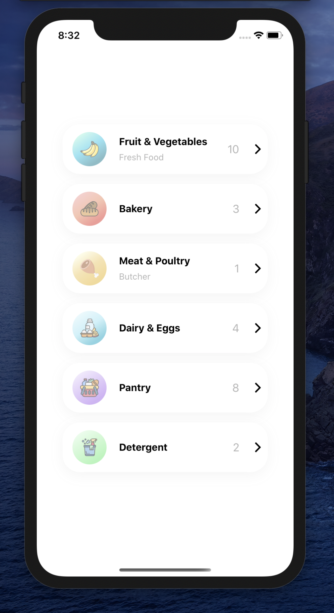
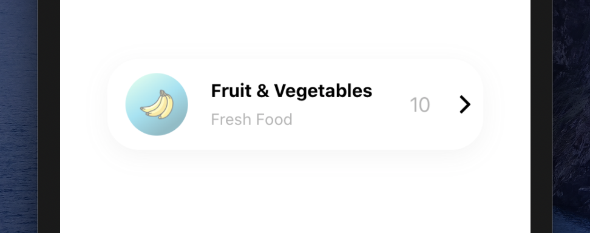

# Demo

<table>
<tr>
<td align="center">
  
</td>
</tr>
<tr>
<td align="center">
  
</td>
  </tr>
  <tr>
  
  </tr>
</table>

# Installation

Add the dependency:

```ruby
npm i react-native-category-card
```

## Peer Dependencies

###### IMPORTANT! You need install them

```js
"react": ">= 16.x.x",
"react-native": ">= 0.55.x",
"react-native-androw": ">= 0.0.34",
"react-native-linear-gradient": ">= 2.5.6",
"@freakycoder/react-native-helpers": ">= 0.1.3",
"@freakycoder/react-native-custom-text": ">= 0.0.12",
"@freakycoder/react-native-bounceable": ">= 0.1.1"
```

# Usage

## Import

```js
import CategoryCard from "react-native-category-card";
```

## CategoryCard Usage

```js
<CategoryCard onPress={() => console.log("Fruits")} />
```

```js
<CategoryCard
  titleText={"Meat & Poultry"}
  customDescriptionComponent={<Text fontSize={20}>Butcher</Text>}
  count={1}
  gradientColors={["#FAF9D1", "#EECA66", "#E8B730"]}
  imageSource={require("./lib/assets/meat.png")}
  onPress={() => console.log("Meat & Poultry")}
/>
```

```js
<CategoryCard
  titleText="Books"
  borderRadius={16}
  disableDescriptionText={true}
  count={3}
  gradientColors={["#F4A09C", "#EE8F66", "#E83A30"]}
  imageSource={require("./lib/asset/book.png")}
  onPress={() => console.log("Books")}
/>
```

# Configuration - Props

| Property                   |   Type    |              Default              | Description                                                |
| -------------------------- | :-------: | :-------------------------------: | ---------------------------------------------------------- |
| shadowStyle                |   style   |                fdf                | change the shadowStyle                                     |
| shadowColor                |  string   |             '#757575'             | change the shadowColor                                     |
| height                     |  number   |                80                 | change the containers height                               |
| width                      |  number   |        ScreenWidth \* 0.8         | change the the containers width                            |
| borderRadius               |  number   |                32                 | change the the containers borderRadius                     |
| backgroundColor            |  string   |              '#fff'               | change the containers backgroundColor                      |
| gradientColors             |   array   | ['#9CF4DF', '#30C9E8', '#107C91'] | change the Linear Gradient Colors                          |
| imageStyle                 |   style   |              default              | change the left image style                                |
| imageSource                |   asset   |              default              | change the image source                                    |
| customImageComponent       | component |              default              | set your own custom component instead of default Image one |
| titleText                  |   style   |              default              | change the title text                                      |
| customTitleTextComponent   | component |              default              | set your own custom component instead of default Text one  |
| disableDescriptionText     |  boolean  |               false               | change the disable description text                        |
| descriptionText            |  string   |                                   | change the description text                                |
| customDescriptionComponent | component |              default              | set your own custom component instead of default Text one  |
| count                      |  number   |                10                 | change the count                                           |
| disableCountContainer      |  boolean  |               false               | change the disable count container                         |
| customCountTextComponent   | component |              default              | set your own custom component instead of default Text one  |
| onPress                    | function  |                ()                 | set your own function when onPress                         |
| rightButtonImageSource     |   asset   |              default              | change the right button image source                       |
| buttonImageStyle           |   style   |              default              | change the button image style                              |

## Future Plans

- [x] ~~LICENSE~~

# Change Log

Change log will be here !

## Author

Sevval Eygul, sevvalleygull@gmail.com

## License

React Native Category Card is available under the MIT license. See the LICENSE file for more info.

```

```
