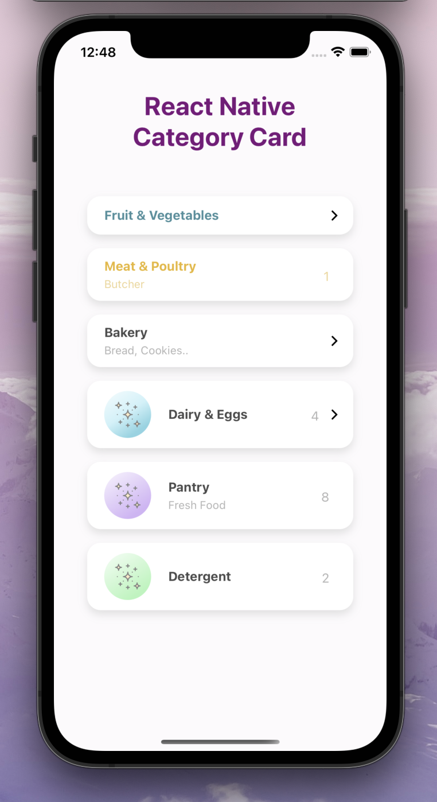

# Demo

<table>

  <tr>
    <td>
      
    </td>
    <td>
      
      </td>
  </tr>
</table>

# Installation

Add the dependency:

```ruby
npm i react-native-category-card
```

## Peer Dependencies

###### IMPORTANT! You need install them

```js
"react-native-androw": ">= 0.0.34",
"react-native-linear-gradient": ">= 2.5.6",
"@freakycoder/react-native-bounceable": ">= 0.1.1"
```

# Usage

## Import

```js
import CategoryCard from "react-native-category-card";
```

## CategoryCard Usage

```js
<CategoryCard onPress={() => console.log("Fruits")} />
```

```js
<CategoryCard
  titleText={"Meat & Poultry"}
  descriptionText={"Butcher"}
  count={1}
  disableRightButton
  titleColor="#E8B730"
  descriptionColor="#edd695"
  onPress={() => console.log("Meat & Poultry")}
/>
```

```js
<CategoryCard
  titleText={"Pantry"}
  descriptionText="Fresh Food"
  disableRightButton
  count={8}
  gradientColors={["#E5D1FA", "#C69CF4", "#A866EE"]}
  imageSource={require("./lib/asset/star.png")}
  onPress={() => console.log("Pantry")}
/>
```

# Configuration - Props

| Property                   |   Type    |              Default              | Description                                                |
| -------------------------- | :-------: | :-------------------------------: | ---------------------------------------------------------- |
| shadowStyle                |   style   |              default              | change the shadowStyle                                     |
| shadowColor                |  string   |             '#757575'             | change the shadowColor                                     |
| height                     |  number   |                                   | change the containers height                               |
| width                      |  number   |        ScreenWidth \* 0.8         | change the the containers width                            |
| borderRadius               |  number   |                16                 | change the the containers borderRadius                     |
| backgroundColor            |  string   |              '#fff'               | change the containers backgroundColor                      |
| gradientColors             |   array   | ['#9CF4DF', '#30C9E8', '#107C91'] | change the Linear Gradient Colors                          |
| imageStyle                 |   style   |              default              | change the left image style                                |
| imageSource                |   asset   |              default              | change the image source                                    |
| customImageComponent       | component |              default              | set your own custom component instead of default Image one |
| titleText                  |   style   |              default              | change the title text                                      |
| titleColor                 |  string   |             "#4B4B4B"             | change the title text color                                |
| customTitleTextComponent   | component |              default              | set your own custom component instead of default Text one  |
| descriptionText            |  string   |                                   | change the description text                                |
| descriptionColor           |  string   |             "#B4B4B4"             | change the description text color                          |
| customDescriptionComponent | component |              default              | set your own custom component instead of default Text one  |
| count                      |  number   |                10                 | change the count                                           |
| customCountTextComponent   | component |              default              | set your own custom component instead of default Text one  |
| onPress                    | function  |                ()                 | set your own function when onPress                         |
| rightButtonImageSource     |   asset   |              default              | change the right button image source                       |
| buttonImageStyle           |   style   |              default              | change the button image style                              |
| disableRightButton         |  boolean  |               true                | disable the right button                                   |

## Future Plans

- [x] ~~LICENSE~~

# Change Log

Change log will be here !

## Author

Sevval Eygul, sevvalleygull@gmail.com

## License

React Native Category Card is available under the MIT license. See the LICENSE file for more info.

```

```
